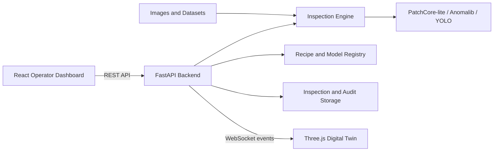

# VisionOps AI

AI-powered visual quality inspection for pharmaceutical products, featuring anomaly detection, defect localization, batch analytics, and a real-time 3D digital twin.


## Overview

VisionOps AI is an end-to-end proof of concept for automated pharmaceutical visual inspection. It demonstrates how computer vision can inspect tablets, capsules, softgels, and blister packs while maintaining traceable quality records.

Operators can create inspection recipes, train anomaly-detection models using normal samples, inspect individual images or batches, review localized defect evidence, and monitor the process through a live 3D digital twin.

> This project is an engineering prototype intended for demonstration and research. It is not validated for production pharmaceutical use.

## Key Features

- Normal-sample anomaly detection for identifying previously unseen defects
- Heatmap-based defect localization with severity and confidence estimates
- Single-image and batch inspection workflows
- Good, review, and reject classifications
- Product recipes for tablets, capsules, softgels, and blister packs
- Model versioning with approval and activation workflows
- Runtime latency and model-cache telemetry
- Persistent inspection history and QA audit events
- Real-time WebSocket synchronization
- Interactive Three.js digital twin
- Simulated conveyor, camera, reject gate, and sorting bins
- Synthetic blister-image generation for demonstrations
- PatchCore-lite and Anomalib training pipelines
- YOLO dataset validation and supervised-training integration

## System Architecture



The backend owns the inspection and digital-twin state. Each inspection updates the dashboard, quality counters, evidence view, equipment state, reject route, and audit timeline.

## Technology Stack

| Area | Technologies |
|---|---|
| Frontend | React, TypeScript, Vite, Three.js |
| Backend | Python, FastAPI, Pydantic, Uvicorn |
| Computer vision | Pillow, NumPy, PatchCore-lite |
| Extended ML | Anomalib, EfficientAD, YOLO |
| Communication | REST APIs, WebSockets |
| Testing | Pytest, HTTPX |
| Deployment | Docker, Docker Compose, Nginx |

## Quick Start with Docker

### Prerequisites

- Git
- Docker Desktop
- Docker Compose

### Installation

```bash
git clone https://github.com/binnuuuu/VisionOps-AI.git
cd VisionOps-AI
cp .env.docker.example .env
docker compose up --build
```

Open:

- Dashboard: [http://127.0.0.1:5173](http://127.0.0.1:5173)
- API: [http://127.0.0.1:8000](http://127.0.0.1:8000)
- Interactive API documentation: [http://127.0.0.1:8000/docs](http://127.0.0.1:8000/docs)

To stop the application:

```bash
docker compose down
```

## Local Development

### Backend

```bash
python3 -m venv .venv
source .venv/bin/activate
pip install -r backend/requirements.txt
python scripts/make_synthetic_blisters.py
PYTHONPATH=. uvicorn backend.app.main:app --reload --port 8000
```

### Frontend

Open another terminal:

```bash
cd frontend
npm install
npm run dev
```

Then visit [http://127.0.0.1:5173](http://127.0.0.1:5173).

## Suggested Demo Workflow

1. Select the prepared capsule recipe or create a product recipe.
2. Teach the system using at least three normal product images.
3. Inspect an image from:
   - `data/sample_images/visa_capsules/anomaly`
   - `data/demo_blisters/defect`
4. Run a batch inspection using multiple sample images.
5. Review the anomaly score, heatmap, defect classification, and severity.
6. Open the digital twin to observe inspection and sorting events.
7. Review batch statistics, model versions, latency telemetry, and audit history.

## Digital Twin

The digital twin visualizes backend inspection events rather than running as an isolated animation.

It models:

- Product feeder
- Conveyor
- Camera and inspection station
- AI decision unit
- Reject actuator
- Good and reject bins
- Inspection evidence display
- Live equipment and batch state
- Event timeline

Relevant endpoints:

```text
GET /api/twin/state
WS  /api/twin/ws
```

Single and batch inspections move products through feeding, image capture, analysis, decision, and sorting phases. Rejected products activate the reject route and update the corresponding counters and timeline events.

## Machine-Learning Approach

Many industrial inspection systems must detect defects that were not represented in a labeled training set. VisionOps therefore begins with normal-sample anomaly detection.

The repository includes:

- A lightweight PatchCore-inspired implementation
- Anomalib integration for PatchCore and EfficientAD
- Dataset preparation and evaluation utilities
- Heatmap generation and threshold tuning
- A YOLO training wrapper for labeled defect datasets
- Synthetic data generation for repeatable demonstrations

This design allows the application to work with a small collection of acceptable samples while leaving a path toward more advanced supervised and deep-feature models.

## Testing

Run the backend test suite locally:

```bash
python -m pytest -q
```

Or run it using Docker:

```bash
docker compose run --rm backend python -m pytest -q
```

Build the frontend:

```bash
cd frontend
npm install
npm run build
```

## Project Structure

```text
VisionOps-AI/
├── backend/                 # FastAPI application and tests
├── frontend/                # React dashboard and digital twin
├── ml/                      # Anomaly-detection implementation
├── scripts/                 # Training, evaluation, and data utilities
├── configs/                 # Model and dataset configuration
├── data/                    # Demonstration images and local artifacts
├── datasets/                # Dataset catalog and downloaded datasets
├── docs/                    # Technical documentation
├── docker-compose.yml
└── README.md
```

## Documentation

Additional guides are available in the `docs` directory:

- [Docker setup](docs/docker.md)
- [Training pipeline](docs/training_pipeline.md)
- [Anomalib training](docs/anomalib_training.md)
- [Dataset sourcing](docs/dataset_sourcing.md)
- [VisA capsule results](docs/visa_capsules_results.md)

## Engineering Highlights

This project demonstrates experience with:

- Full-stack application architecture
- REST and WebSocket API design
- Computer-vision model integration
- Anomaly-detection workflows
- Real-time 3D visualization
- State synchronization
- Model lifecycle management
- Quality audit trails
- Automated testing
- Containerized deployment

## Future Improvements

- Evaluate deep-feature models on GPU
- Train supervised detectors using real defect annotations
- Add live industrial-camera ingestion
- Integrate PLC or GPIO reject signals
- Introduce role-based access control
- Add electronic signatures and approval workflows
- Add database-backed production storage
- Perform validation using real manufacturing-line data

## Author

Developed by [binnuuuu](https://github.com/binnuuuu).

If you found this project useful or interesting, consider giving it a star.